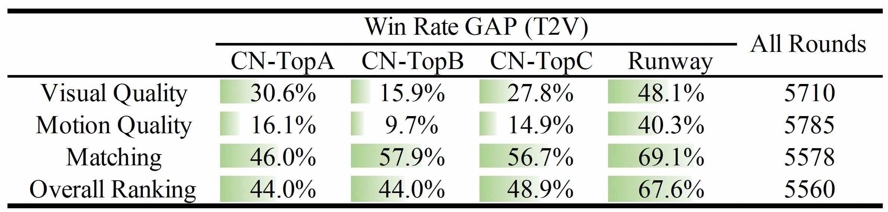
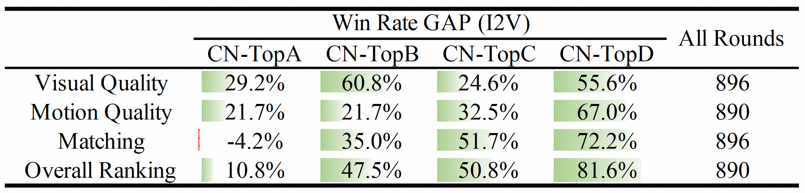
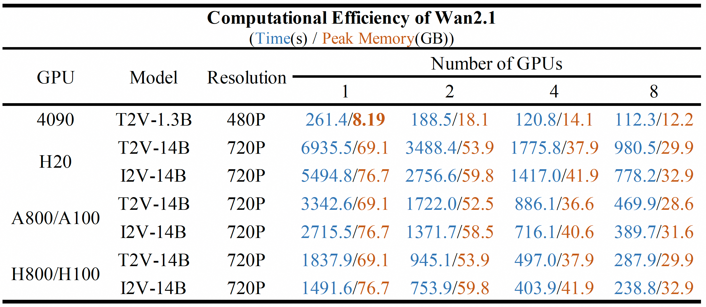

# Wan2.1

<p align="center">
    
<p>

<p align="center">
    💜 <a href="https://wan.video"><b>Wan官网</b></a> &nbsp&nbsp ｜ &nbsp&nbsp 🖥️ <a href="https://github.com/Wan-Video/Wan2.1">GitHub代码库</a> &nbsp&nbsp  | &nbsp&nbsp🤗 <a href="https://huggingface.co/Wan-AI/">Hugging Face</a>&nbsp&nbsp | &nbsp&nbsp🤖 <a href="https://modelscope.cn/organization/Wan-AI">魔搭社区（ModelScope）</a>&nbsp&nbsp | &nbsp&nbsp 📑 <a href="https://arxiv.org/abs/2503.20314">技术报告</a> &nbsp&nbsp | &nbsp&nbsp 📑 <a href="https://wan.video/welcome?spm=a2ty_o02.30011076.0.0.6c9ee41eCcluqg">博客</a> &nbsp&nbsp | &nbsp&nbsp💬 <a href="https://gw.alicdn.com/imgextra/i2/O1CN01tqjWFi1ByuyehkTSB_!!6000000000015-0-tps-611-1279.jpg">微信群</a>&nbsp&nbsp | &nbsp&nbsp 📖 <a href="https://discord.gg/AKNgpMK4Yj">Discord社区</a>&nbsp&nbsp
<br>

-----

[**Wan：开源且先进的大规模视频生成基础模型**](https://arxiv.org/abs/2503.20314)

在本代码库中，我们推出了**Wan2.1**——一套全面且开源的视频基础模型套件，突破了视频生成技术的边界。**Wan2.1** 具备以下核心特性：
- 👍 **业界领先性能（SOTA）**：**Wan2.1** 在多个基准测试中，持续超越现有开源模型和顶尖商业解决方案。
- 👍 **支持消费级显卡**：T2V-1.3B 模型仅需 8.19 GB 显存，几乎兼容所有消费级 GPU。在 RTX 4090 上，生成一段 5 秒的 480P 视频约需 4 分钟（未使用量化等优化技术），性能甚至可媲美部分闭源模型。
- 👍 **多任务能力**：**Wan2.1** 擅长文本生成视频（Text-to-Video）、图片生成视频（Image-to-Video）、视频编辑、文本生成图片、视频生成音频等任务，推动视频生成领域发展。
- 👍 **视觉文本生成**：**Wan2.1** 是首个支持中英文文本生成的视频模型，文本生成效果稳定，大幅提升实际应用价值。
- 👍 **高性能视频VAE**：Wan-VAE 兼具极致效率与性能，可对任意时长的 1080P 视频进行编码和解码，同时保留时序信息，是视频和图片生成任务的理想基础组件。

## 视频演示

<div align="center">
  <video src="https://github.com/user-attachments/assets/4aca6063-60bf-4953-bfb7-e265053f49ef" width="70%" poster=""> </video>
</div>

## 🔥 最新动态！！

* 2025年5月14日：👋 我们发布了 **Wan2.1** 的 [VACE](https://github.com/ali-vilab/VACE) 模型——一款集视频创作与编辑于一体的全能模型，同时开放了[推理代码](#运行vace)、[模型权重](#模型下载)和[技术报告](https://arxiv.org/abs/2503.07598)！
* 2025年4月17日：👋 我们推出了 **Wan2.1** 的 [FLF2V](#运行首尾帧生成视频任务) 模型，同步开放推理代码和权重！
* 2025年3月21日：👋 我们正式发布 **Wan2.1** 的[技术报告](https://files.alicdn.com/tpsservice/5c9de1c74de03972b7aa657e5a54756b.pdf)，欢迎各位交流与反馈！
* 2025年3月3日：👋 **Wan2.1** 的 T2V 和 I2V 模块已集成至 Diffusers 库（[T2V](https://huggingface.co/docs/diffusers/main/en/api/pipelines/wan#diffusers.WanPipeline) | [I2V](https://huggingface.co/docs/diffusers/main/en/api/pipelines/wan#diffusers.WanImageToVideoPipeline)），欢迎体验！
* 2025年2月27日：👋 **Wan2.1** 已集成至 [ComfyUI](https://comfyanonymous.github.io/ComfyUI_examples/wan/)，尽情使用吧！
* 2025年2月25日：👋 我们发布了 **Wan2.1** 的推理代码和模型权重。

## 社区优秀成果
如果你的工作对 **Wan2.1** 进行了优化，且希望更多人了解，欢迎告知我们。
- [Video-As-Prompt](https://github.com/bytedance/Video-As-Prompt)：首个基于 **Wan2.1-14B-I2V** 构建的统一语义可控视频生成模型，采用混合Transformer架构，支持上下文控制（如概念、风格、动作、镜头等）。更多案例详见[项目主页](https://bytedance.github.io/Video-As-Prompt/)。
- [LightX2V](https://github.com/ModelTC/LightX2V)：轻量级高效视频生成框架，集成 **Wan2.1** 和 **Wan2.2**，支持多种工程加速技术实现快速推理，可在 RTX 5090 和 RTX 4060（8GB 显存）上运行。
- [DriVerse](https://github.com/shalfun/DriVerse)：基于 **Wan2.1-14B-I2V** 的自动驾驶世界模型，可根据任意场景帧和给定轨迹生成未来驾驶视频。更多案例详见[项目主页](https://github.com/shalfun/DriVerse/tree/main)。
- [Training-Free-WAN-Editing](https://github.com/KyujinHan/Awesome-Training-Free-WAN2.1-Editing)：基于 **Wan2.1-T2V-1.3B** 实现免训练视频编辑，适配基于图片的免训练方法（如 [FlowEdit](https://arxiv.org/abs/2412.08629) 和 [FlowAlign](https://arxiv.org/abs/2505.23145)）。
- [Wan-Move](https://github.com/ali-vilab/Wan-Move)：入选 NeurIPS 2025，该框架让 **Wan2.1-I2V-14B** 实现业界领先的细粒度、点级运动控制！更多信息详见[项目主页](https://wan-move.github.io/)。
- [EchoShot](https://github.com/JoHnneyWang/EchoShot)：基于 **Wan2.1-T2V-1.3B** 的原生多镜头人像视频生成模型，支持生成同一人物的多段视频片段，且具备高度灵活的内容可控性。更多信息详见[项目主页](https://johnneywang.github.io/EchoShot-webpage/)。
- [AniCrafter](https://github.com/MyNiuuu/AniCrafter)：基于 **Wan2.1-14B-I2V** 的以人为中心的动画模型，通过 3DGS 数字人控制视频扩散模型，可将任意人物插入任意场景并按照给定动作序列生成动画。更多案例详见[项目主页](https://myniuuu.github.io/AniCrafter)。
- [HyperMotion](https://vivocameraresearch.github.io/hypermotion/)：基于 **Wan2.1** 的人体图像动画框架，解决了姿态引导动画中复杂人体动作生成的难题。更多案例详见[项目官网](https://vivocameraresearch.github.io/magictryon/)。
- [MagicTryOn](https://vivocameraresearch.github.io/magictryon/)：基于 **Wan2.1-14B-I2V** 构建的视频虚拟试穿框架，解决了现有模型在服装细节表达和人体运动动态稳定性方面的局限性。更多案例详见[项目官网](https://vivocameraresearch.github.io/magictryon/)。
- [ATI](https://github.com/bytedance/ATI)：基于 **Wan2.1-I2V-14B** 的轨迹式运动控制框架，统一了视频生成中的物体运动、局部运动和镜头运动控制。更多信息详见[项目官网](https://anytraj.github.io/)。
- [Phantom](https://github.com/Phantom-video/Phantom)：基于 **Wan2.1-T2V-1.3B** 和 **Wan2.1-T2V-14B** 开发了统一的单主体/多主体参考视频生成框架。更多案例详见[项目仓库](https://github.com/Phantom-video/Phantom)。
- [UniAnimate-DiT](https://github.com/ali-vilab/UniAnimate-DiT)：基于 **Wan2.1-14B-I2V** 训练的人体图像动画模型，已开源推理和训练代码，欢迎体验！
- [CFG-Zero](https://github.com/WeichenFan/CFG-Zero-star)：从 CFG（Classifier-Free Guidance）角度对 **Wan2.1** 进行优化（覆盖 T2V 和 I2V 模型）。
- [TeaCache](https://github.com/ali-vilab/TeaCache)：现已支持 **Wan2.1** 加速，可将推理速度提升约 2 倍，欢迎尝试！
- [DiffSynth-Studio](https://github.com/modelscope/DiffSynth-Studio)：为 **Wan2.1** 提供更多扩展支持，包括视频转视频、FP8 量化、显存优化、LoRA 训练等。更多案例详见[项目示例](https://github.com/modelscope/DiffSynth-Studio/tree/main/examples/wanvideo)。


## 📑 待办清单
- Wan2.1 文本生成视频（T2V）
    - [x] 14B 和 1.3B 模型的多GPU推理代码
    - [x] 14B 和 1.3B 模型的权重文件
    - [x] Gradio 演示界面
    - [x] ComfyUI 集成
    - [x] Diffusers 集成
    - [ ] Diffusers + 多GPU推理
- Wan2.1 图片生成视频（I2V）
    - [x] 14B 模型的多GPU推理代码
    - [x] 14B 模型的权重文件
    - [x] Gradio 演示界面
    - [x] ComfyUI 集成
    - [x] Diffusers 集成
    - [ ] Diffusers + 多GPU推理
- Wan2.1 首尾帧生成视频（FLF2V）
    - [x] 14B 模型的多GPU推理代码
    - [x] 14B 模型的权重文件
    - [x] Gradio 演示界面
    - [ ] ComfyUI 集成
    - [ ] Diffusers 集成
    - [ ] Diffusers + 多GPU推理
- Wan2.1 VACE
    - [x] 14B 和 1.3B 模型的多GPU推理代码
    - [x] 14B 和 1.3B 模型的权重文件
    - [x] Gradio 演示界面
    - [x] ComfyUI 集成
    - [ ] Diffusers 集成
    - [ ] Diffusers + 多GPU推理

## 快速开始

### 环境安装
克隆代码库：
```sh
git clone https://github.com/Wan-Video/Wan2.1.git
cd Wan2.1
```

安装依赖：
```sh
# 确保 torch 版本 >= 2.4.0
pip install -r requirements.txt
```


### 模型下载

| 模型名称       | 下载链接                                                                                                                                           | 备注说明                      |
|----------------|---------------------------------------------------------------------------------------------------------------------------------------------------------|-------------------------------|
| T2V-14B        | 🤗 [Huggingface](https://huggingface.co/Wan-AI/Wan2.1-T2V-14B)      🤖 [ModelScope](https://www.modelscope.cn/models/Wan-AI/Wan2.1-T2V-14B)             | 支持 480P 和 720P 分辨率
| I2V-14B-720P   | 🤗 [Huggingface](https://huggingface.co/Wan-AI/Wan2.1-I2V-14B-720P)    🤖 [ModelScope](https://www.modelscope.cn/models/Wan-AI/Wan2.1-I2V-14B-720P)     | 支持 720P 分辨率
| I2V-14B-480P   | 🤗 [Huggingface](https://huggingface.co/Wan-AI/Wan2.1-I2V-14B-480P)    🤖 [ModelScope](https://www.modelscope.cn/models/Wan-AI/Wan2.1-I2V-14B-480P)     | 支持 480P 分辨率
| T2V-1.3B       | 🤗 [Huggingface](https://huggingface.co/Wan-AI/Wan2.1-T2V-1.3B)     🤖 [ModelScope](https://www.modelscope.cn/models/Wan-AI/Wan2.1-T2V-1.3B)            | 支持 480P 分辨率
| FLF2V-14B      | 🤗 [Huggingface](https://huggingface.co/Wan-AI/Wan2.1-FLF2V-14B-720P)     🤖 [ModelScope](https://www.modelscope.cn/models/Wan-AI/Wan2.1-FLF2V-14B-720P) | 支持 720P 分辨率
| VACE-1.3B      | 🤗 [Huggingface](https://huggingface.co/Wan-AI/Wan2.1-VACE-1.3B)     🤖 [ModelScope](https://www.modelscope.cn/models/Wan-AI/Wan2.1-VACE-1.3B)          | 支持 480P 分辨率
| VACE-14B       | 🤗 [Huggingface](https://huggingface.co/Wan-AI/Wan2.1-VACE-14B)     🤖 [ModelScope](https://www.modelscope.cn/models/Wan-AI/Wan2.1-VACE-14B)        | 支持 480P 和 720P 分辨率

> 💡注意：
> * 1.3B 模型虽可生成 720P 分辨率视频，但由于该分辨率下的训练数据有限，效果稳定性不如 480P。为获得最佳效果，建议使用 480P 分辨率。
> * 首尾帧生成视频任务的模型主要基于中文文本-视频对训练，因此建议使用中文提示词以获得更好效果。


通过 huggingface-cli 下载模型：
``` sh
pip install "huggingface_hub[cli]"
huggingface-cli download Wan-AI/Wan2.1-T2V-14B --local-dir ./Wan2.1-T2V-14B
```

通过 modelscope-cli 下载模型：
``` sh
pip install modelscope
modelscope download Wan-AI/Wan2.1-T2V-14B --local_dir ./Wan2.1-T2V-14B
```

### 运行文本生成视频（Text-to-Video）

本代码库支持两种文本生成视频模型（1.3B 和 14B）及两种分辨率（480P 和 720P），模型参数与配置如下：

<table>
    <thead>
        <tr>
            <th rowspan="2">任务类型</th>
            <th colspan="2">分辨率支持</th>
            <th rowspan="2">对应模型</th>
        </tr>
        <tr>
            <th>480P</th>
            <th>720P</th>
        </tr>
    </thead>
    <tbody>
        <tr>
            <td>t2v-14B</td>
            <td style="color: green;">✔️</td>
            <td style="color: green;">✔️</td>
            <td>Wan2.1-T2V-14B</td>
        </tr>
        <tr>
            <td>t2v-1.3B</td>
            <td style="color: green;">✔️</td>
            <td style="color: red;">❌</td>
            <td>Wan2.1-T2V-1.3B</td>
        </tr>
    </tbody>
</table>


#### (1) 不使用提示词扩展

为便于快速上手，我们先从基础版推理流程开始，跳过[提示词扩展](#2-使用提示词扩展)步骤。

- 单GPU推理

``` sh
python generate.py  --task t2v-14B --size 1280*720 --ckpt_dir ./Wan2.1-T2V-14B --prompt "两只拟人化的猫咪穿着舒适的拳击装备和亮色手套，在聚光灯下的舞台上激烈对打。"
```

若遇到显存不足（OOM）问题，可使用 `--offload_model True` 和 `--t5_cpu` 参数降低GPU显存占用。例如在 RTX 4090 显卡上：

``` sh
python generate.py  --task t2v-1.3B --size 832*480 --ckpt_dir ./Wan2.1-T2V-1.3B --offload_model True --t5_cpu --sample_shift 8 --sample_guide_scale 6 --prompt "两只拟人化的猫咪穿着舒适的拳击装备和亮色手套，在聚光灯下的舞台上激烈对打。"
```

> 💡注意：使用 `T2V-1.3B` 模型时，建议将 `--sample_guide_scale` 参数设为 6。`--sample_shift` 参数可根据生成效果在 8~12 范围内调整。


- 多GPU推理（基于 FSDP + xDiT USP）

  我们采用 FSDP 和 [xDiT](https://github.com/xdit-project/xDiT) USP 加速推理过程。

  * 尤利西斯策略（Ulysses）

    若要使用 [`Ulysses`](https://arxiv.org/abs/2309.14509) 策略，需设置 `--ulysses_size $GPU数量`。注意：使用该策略时，模型的注意力头数（num_heads）需能被 `ulysses_size` 整除。1.3B 模型的注意力头数为 12，无法被 8 整除（多数多GPU机器为8卡），因此建议改用 Ring 策略。

  * 环形策略（Ring）

    若要使用 [`Ring`](https://arxiv.org/pdf/2310.01889) 策略，需设置 `--ring_size $GPU数量`。注意：使用该策略时，序列长度需能被 `ring_size` 整除。

  当然，也可组合使用 `Ulysses` 和 `Ring` 策略。

``` sh
pip install "xfuser>=0.4.1"
torchrun --nproc_per_node=8 generate.py --task t2v-14B --size 1280*720 --ckpt_dir ./Wan2.1-T2V-14B --dit_fsdp --t5_fsdp --ulysses_size 8 --prompt "两只拟人化的猫咪穿着舒适的拳击装备和亮色手套，在聚光灯下的舞台上激烈对打。"
```


#### (2) 使用提示词扩展

扩展提示词可有效丰富生成视频的细节，进一步提升视频质量，因此我们建议开启该功能。我们提供以下两种提示词扩展方式：

- 通过 Dashscope API 扩展
  - 提前申请 `dashscope.api_key`（[英文教程](https://www.alibabacloud.com/help/en/model-studio/getting-started/first-api-call-to-qwen) | [中文教程](https://help.aliyun.com/zh/model-studio/getting-started/first-api-call-to-qwen)）。
  - 配置环境变量 `DASH_API_KEY` 指定 Dashscope API 密钥；阿里云国际站用户还需设置环境变量 `DASH_API_URL` 为 'https://dashscope-intl.aliyuncs.com/api/v1'。更多细节参考[Dashscope 文档](https://www.alibabacloud.com/help/en/model-studio/developer-reference/use-qwen-by-calling-api?spm=a2c63.p38356.0.i1)。
  - 文本生成视频任务使用 `qwen-plus` 模型，图片生成视频任务使用 `qwen-vl-max` 模型。
  - 可通过 `--prompt_extend_model` 参数修改扩展所用模型，示例：
```sh
DASH_API_KEY=你的密钥 python generate.py  --task t2v-14B --size 1280*720 --ckpt_dir ./Wan2.1-T2V-14B --prompt "两只拟人化的猫咪穿着舒适的拳击装备和亮色手套，在聚光灯下的舞台上激烈对打。" --use_prompt_extend --prompt_extend_method 'dashscope' --prompt_extend_target_lang 'zh'
```

- 通过本地模型扩展

  - 默认使用 HuggingFace 上的 Qwen 模型进行扩展，用户可根据GPU显存大小选择 Qwen 系列或其他模型。
  - 文本生成视频任务可选用 `Qwen/Qwen2.5-14B-Instruct`、`Qwen/Qwen2.5-7B-Instruct`、`Qwen/Qwen2.5-3B-Instruct` 等模型。
  - 图片生成视频或首尾帧生成视频任务可选用 `Qwen/Qwen2.5-VL-7B-Instruct`、`Qwen/Qwen2.5-VL-3B-Instruct` 等模型。
  - 模型越大，扩展效果通常越好，但所需GPU显存也越多。
  - 可通过 `--prompt_extend_model` 参数指定扩展所用模型（支持本地模型路径或Hugging Face模型名），示例：

``` sh
python generate.py  --task t2v-14B --size 1280*720 --ckpt_dir ./Wan2.1-T2V-14B --prompt "两只拟人化的猫咪穿着舒适的拳击装备和亮色手套，在聚光灯下的舞台上激烈对打。" --use_prompt_extend --prompt_extend_method 'local_qwen' --prompt_extend_target_lang 'zh'
```


#### (3) 通过 Diffusers 运行

可通过以下命令快速使用 Diffusers 库推理 **Wan2.1**-T2V 模型：
``` python
import torch
from diffusers.utils import export_to_video
from diffusers import AutoencoderKLWan, WanPipeline
from diffusers.schedulers.scheduling_unipc_multistep import UniPCMultistepScheduler

# 可选模型：Wan-AI/Wan2.1-T2V-14B-Diffusers, Wan-AI/Wan2.1-T2V-1.3B-Diffusers
model_id = "Wan-AI/Wan2.1-T2V-14B-Diffusers"
vae = AutoencoderKLWan.from_pretrained(model_id, subfolder="vae", torch_dtype=torch.float32)
flow_shift = 5.0 # 720P 分辨率设为 5.0，480P 设为 3.0
scheduler = UniPCMultistepScheduler(prediction_type='flow_prediction', use_flow_sigmas=True, num_train_timesteps=1000, flow_shift=flow_shift)
pipe = WanPipeline.from_pretrained(model_id, vae=vae, torch_dtype=torch.bfloat16)
pipe.scheduler = scheduler
pipe.to("cuda")

prompt = "一只猫和一只狗在厨房里一起烤蛋糕。猫咪小心翼翼地称量面粉，狗狗则用木勺搅拌面糊。厨房温馨舒适，阳光透过窗户洒进来。"
negative_prompt = "色调过亮、曝光过度、静态画面、细节模糊、字幕、画风、作品、绘画、图像、静止、整体偏灰、最差画质、低质量、JPEG压缩残留、丑陋、不完整、多余手指、手部绘制粗糙、面部绘制粗糙、变形、毁容、肢体畸形、手指粘连、静态图片、背景杂乱、三条腿、背景多人、倒走"

output = pipe(
     prompt=prompt,
     negative_prompt=negative_prompt,
     height=720,
     width=1280,
     num_frames=81,
     guidance_scale=5.0,
    ).frames[0]
export_to_video(output, "output.mp4", fps=16)
```
> 💡注意：该示例未集成提示词扩展和分布式推理功能，我们将尽快更新集成提示词扩展的多GPU版本 Diffusers 代码。


#### (4) 运行本地 Gradio 界面

``` sh
cd gradio
# 使用 dashscope API 进行提示词扩展
DASH_API_KEY=你的密钥 python t2v_14B_singleGPU.py --prompt_extend_method 'dashscope' --ckpt_dir ./Wan2.1-T2V-14B

# 使用本地模型进行提示词扩展
python t2v_14B_singleGPU.py --prompt_extend_method 'local_qwen' --ckpt_dir ./Wan2.1-T2V-14B
```


### 运行图片生成视频（Image-to-Video）

与文本生成视频类似，图片生成视频也分为使用和不使用提示词扩展两个流程，具体参数及配置如下：
<table>
    <thead>
        <tr>
            <th rowspan="2">任务类型</th>
            <th colspan="2">分辨率支持</th>
            <th rowspan="2">对应模型</th>
        </tr>
        <tr>
            <th>480P</th>
            <th>720P</th>
        </tr>
    </thead>
    <tbody>
        <tr>
            <td>i2v-14B</td>
            <td style="color: green;">❌</td>
            <td style="color: green;">✔️</td>
            <td>Wan2.1-I2V-14B-720P</td>
        </tr>
        <tr>
            <td>i2v-14B</td>
            <td style="color: green;">✔️</td>
            <td style="color: red;">❌</td>
            <td>Wan2.1-T2V-14B-480P</td>
        </tr>
    </tbody>
</table>


#### (1) 不使用提示词扩展

- 单GPU推理
```sh
python generate.py --task i2v-14B --size 1280*720 --ckpt_dir ./Wan2.1-I2V-14B-720P --image examples/i2v_input.JPG --prompt "夏日海滩度假风格，一只戴着墨镜的白色猫咪坐在冲浪板上。这只毛茸茸的猫咪直视镜头，神情放松。背景是模糊的海滩景色，有清澈的海水、远处的青山和点缀着白云的蓝天。猫咪姿态自然舒展，仿佛在享受海风与温暖的阳光。特写镜头突出猫咪的细腻细节和海边清爽的氛围。"
```

> 💡对于图片生成视频任务，`size` 参数代表生成视频的像素面积，宽高比将跟随输入原图。


- 多GPU推理（基于 FSDP + xDiT USP）

```sh
pip install "xfuser>=0.4.1"
torchrun --nproc_per_node=8 generate.py --task i2v-14B --size 1280*720 --ckpt_dir ./Wan2.1-I2V-14B-720P --image examples/i2v_input.JPG --dit_fsdp --t5_fsdp --ulysses_size 8 --prompt "夏日海滩度假风格，一只戴着墨镜的白色猫咪坐在冲浪板上。这只毛茸茸的猫咪直视镜头，神情放松。背景是模糊的海滩景色，有清澈的海水、远处的青山和点缀着白云的蓝天。猫咪姿态自然舒展，仿佛在享受海风与温暖的阳光。特写镜头突出猫咪的细腻细节和海边清爽的氛围。"
```

#### (2) 使用提示词扩展

提示词扩展流程可参考[此处](#2-使用提示词扩展)。

使用 `Qwen/Qwen2.5-VL-7B-Instruct` 本地模型扩展：
```
python generate.py --task i2v-14B --size 1280*720 --ckpt_dir ./Wan2.1-I2V-14B-720P --image examples/i2v_input.JPG --use_prompt_extend --prompt_extend_model Qwen/Qwen2.5-VL-7B-Instruct --prompt "夏日海滩度假风格，一只戴着墨镜的白色猫咪坐在冲浪板上。这只毛茸茸的猫咪直视镜头，神情放松。背景是模糊的海滩景色，有清澈的海水、远处的青山和点缀着白云的蓝天。猫咪姿态自然舒展，仿佛在享受海风与温暖的阳光。特写镜头突出猫咪的细腻细节和海边清爽的氛围。"
```

使用 `dashscope` 远程扩展：
```
DASH_API_KEY=你的密钥 python generate.py --task i2v-14B --size 1280*720 --ckpt_dir ./Wan2.1-I2V-14B-720P --image examples/i2v_input.JPG --use_prompt_extend --prompt_extend_method 'dashscope' --prompt "夏日海滩度假风格，一只戴着墨镜的白色猫咪坐在冲浪板上。这只毛茸茸的猫咪直视镜头，神情放松。背景是模糊的海滩景色，有清澈的海水、远处的青山和点缀着白云的蓝天。猫咪姿态自然舒展，仿佛在享受海风与温暖的阳光。特写镜头突出猫咪的细腻细节和海边清爽的氛围。"
```


#### (3) 通过 Diffusers 运行

可通过以下命令快速使用 Diffusers 库推理 **Wan2.1**-I2V 模型：
``` python
import torch
import numpy as np
from diffusers import AutoencoderKLWan, WanImageToVideoPipeline
from diffusers.utils import export_to_video, load_image
from transformers import CLIPVisionModel

# 可选模型：Wan-AI/Wan2.1-I2V-14B-480P-Diffusers, Wan-AI/Wan2.1-I2V-14B-720P-Diffusers
model_id = "Wan-AI/Wan2.1-I2V-14B-720P-Diffusers"
image_encoder = CLIPVisionModel.from_pretrained(model_id, subfolder="image_encoder", torch_dtype=torch.float32)
vae = AutoencoderKLWan.from_pretrained(model_id, subfolder="vae", torch_dtype=torch.float32)
pipe = WanImageToVideoPipeline.from_pretrained(model_id, vae=vae, image_encoder=image_encoder, torch_dtype=torch.bfloat16)
pipe.to("cuda")

image = load_image(
    "https://huggingface.co/datasets/huggingface/documentation-images/resolve/main/diffusers/astronaut.jpg"
)
max_area = 720 * 1280
aspect_ratio = image.height / image.width
mod_value = pipe.vae_scale_factor_spatial * pipe.transformer.config.patch_size[1]
height = round(np.sqrt(max_area * aspect_ratio)) // mod_value * mod_value
width = round(np.sqrt(max_area / aspect_ratio)) // mod_value * mod_value
image = image.resize((width, height))
prompt = (
    "一名宇航员从蛋壳中孵化而出，身处月球表面，背景呈现出太空的深邃与黑暗。画质高清，细节超写实，镜头视角如电影般震撼。"
)
negative_prompt = "色调过亮、曝光过度、静态画面、细节模糊、字幕、画风、作品、绘画、图像、静止、整体偏灰、最差画质、低质量、JPEG压缩残留、丑陋、不完整、多余手指、手部绘制粗糙、面部绘制粗糙、变形、毁容、肢体畸形、手指粘连、静态图片、背景杂乱、三条腿、背景多人、倒走"

output = pipe(
    image=image,
    prompt=prompt,
    negative_prompt=negative_prompt,
    height=height, width=width,
    num_frames=81,
    guidance_scale=5.0
).frames[0]
export_to_video(output, "output.mp4", fps=16)

```
> 💡注意：该示例未集成提示词扩展和分布式推理功能，我们将尽快更新集成提示词扩展的多GPU版本 Diffusers 代码。


#### (4) 运行本地 Gradio 界面

```sh
cd gradio
# 仅使用 480P 模型
DASH_API_KEY=你的密钥 python i2v_14B_singleGPU.py --prompt_extend_method 'dashscope' --ckpt_dir_480p ./Wan2.1-I2V-14B-480P

# 仅使用 720P 模型
DASH_API_KEY=你的密钥 python i2v_14B_singleGPU.py --prompt_extend_method 'dashscope' --ckpt_dir_720p ./Wan2.1-I2V-14B-720P

# 同时使用 480P 和 720P 模型
DASH_API_KEY=你的密钥 python i2v_14B_singleGPU.py --prompt_extend_method 'dashscope' --ckpt_dir_480p ./Wan2.1-I2V-14B-480P --ckpt_dir_720p ./Wan2.1-I2V-14B-720P
```


### 运行首尾帧生成视频（First-Last-Frame-to-Video）

首尾帧生成视频同样分为使用和不使用提示词扩展两个流程，目前仅支持 720P 分辨率，具体参数及配置如下：
<table>
    <thead>
        <tr>
            <th rowspan="2">任务类型</th>
            <th colspan="2">分辨率支持</th>
            <th rowspan="2">对应模型</th>
        </tr>
        <tr>
            <th>480P</th>
            <th>720P</th>
        </tr>
    </thead>
    <tbody>
        <tr>
            <td>flf2v-14B</td>
            <td style="color: green;">❌</td>
            <td style="color: green;">✔️</td>
            <td>Wan2.1-FLF2V-14B-720P</td>
        </tr>
    </tbody>
</table>


#### (1) 不使用提示词扩展

- 单GPU推理
```sh
python generate.py --task flf2v-14B --size 1280*720 --ckpt_dir ./Wan2.1-FLF2V-14B-720P --first_frame examples/flf2v_input_first_frame.png --last_frame examples/flf2v_input_last_frame.png --prompt "CG动画风格，一只蓝色小鸟从地面起飞，扇动翅膀。小鸟的羽毛细腻，胸前有独特花纹。背景是晴朗阳光下的蓝天白云。镜头跟随小鸟向上移动，以特写、低角度视角捕捉其飞行姿态和天空的辽阔。"
```

> 💡与图片生成视频类似，`size` 参数代表生成视频的像素面积，宽高比将跟随输入原图。


- 多GPU推理（基于 FSDP + xDiT USP）

```sh
pip install "xfuser>=0.4.1"
torchrun --nproc_per_node=8 generate.py --task flf2v-14B --size 1280*720 --ckpt_dir ./Wan2.1-FLF2V-14B-720P --first_frame examples/flf2v_input_first_frame.png --last_frame examples/flf2v_input_last_frame.png --dit_fsdp --t5_fsdp --ulysses_size 8 --prompt "CG动画风格，一只蓝色小鸟从地面起飞，扇动翅膀。小鸟的羽毛细腻，胸前有独特花纹。背景是晴朗阳光下的蓝天白云。镜头跟随小鸟向上移动，以特写、低角度视角捕捉其飞行姿态和天空的辽阔。"
```

#### (2) 使用提示词扩展

提示词扩展流程可参考[此处](#2-使用提示词扩展)。

使用 `Qwen/Qwen2.5-VL-7B-Instruct` 本地模型扩展：
```
python generate.py --task flf2v-14B --size 1280*720 --ckpt_dir ./Wan2.1-FLF2V-14B-720P --first_frame examples/flf2v_input_first_frame.png --last_frame examples/flf2v_input_last_frame.png --use_prompt_extend --prompt_extend_model Qwen/Qwen2.5-VL-7B-Instruct --prompt "CG动画风格，一只蓝色小鸟从地面起飞，扇动翅膀。小鸟的羽毛细腻，胸前有独特花纹。背景是晴朗阳光下的蓝天白云。镜头跟随小鸟向上移动，以特写、低角度视角捕捉其飞行姿态和天空的辽阔。"
```

使用 `dashscope` 远程扩展：
```
DASH_API_KEY=你的密钥 python generate.py --task flf2v-14B --size 1280*720 --ckpt_dir ./Wan2.1-FLF2V-14B-720P --first_frame examples/flf2v_input_first_frame.png --last_frame examples/flf2v_input_last_frame.png --use_prompt_extend --prompt_extend_method 'dashscope' --prompt "CG动画风格，一只蓝色小鸟从地面起飞，扇动翅膀。小鸟的羽毛细腻，胸前有独特花纹。背景是晴朗阳光下的蓝天白云。镜头跟随小鸟向上移动，以特写、低角度视角捕捉其飞行姿态和天空的辽阔。"
```


#### (3) 运行本地 Gradio 界面

```sh
cd gradio
# 使用 720P 模型
DASH_API_KEY=你的密钥 python flf2v_14B_singleGPU.py --prompt_extend_method 'dashscope' --ckpt_dir_720p ./Wan2.1-FLF2V-14B-720P
```


### 运行 VACE

[VACE](https://github.com/ali-vilab/VACE) 目前支持两种模型（1.3B 和 14B）及两种主流分辨率（480P 和 720P）。
输入支持任意分辨率，但为获得最佳效果，视频尺寸需控制在特定范围内。
模型参数与配置如下：

<table>
    <thead>
        <tr>
            <th rowspan="2">任务类型</th>
            <th colspan="2">分辨率支持</th>
            <th rowspan="2">对应模型</th>
        </tr>
        <tr>
            <th>480P(~81x480x832)</th>
            <th>720P(~81x720x1280)</th>
        </tr>
    </thead>
    <tbody>
        <tr>
            <td>VACE</td>
            <td style="color: green; text-align: center; vertical-align: middle;">✔️</td>
            <td style="color: green; text-align: center; vertical-align: middle;">✔️</td>
            <td>Wan2.1-VACE-14B</td>
        </tr>
        <tr>
            <td>VACE</td>
            <td style="color: green; text-align: center; vertical-align: middle;">✔️</td>
            <td style="color: red; text-align: center; vertical-align: middle;">❌</td>
            <td>Wan2.1-VACE-1.3B</td>
        </tr>
    </tbody>
</table>

在 VACE 中，用户可输入文本提示词，以及可选的视频、掩码、图片，完成视频生成或编辑。VACE 的详细使用说明可参考[用户指南](https://github.com/ali-vilab/VACE/blob/main/UserGuide.md)。
执行流程如下：

#### (1) 预处理

用户收集的素材需预处理为 VACE 可识别的输入格式，包括 `src_video`、`src_mask`、`src_ref_images` 和 `prompt`。
对于参考图生成视频（R2V）任务，可跳过该预处理步骤；但对于视频编辑（V2V）和掩码视频编辑（MV2V）任务，需额外预处理以获得包含深度、姿态或掩码区域等条件的视频。
更多细节参考[vace_preproccess](https://github.com/ali-vilab/VACE/blob/main/vace/vace_preproccess.py)。

#### (2) 命令行推理

- 单GPU推理
```sh
python generate.py --task vace-1.3B --size 832*480 --ckpt_dir ./Wan2.1-VACE-1.3B --src_ref_images examples/girl.png,examples/snake.png --prompt "在一个欢乐而充满节日气氛的场景中，穿着鲜艳红色春服的小女孩正与她的可爱卡通蛇嬉戏。她的春服上绣着金色吉祥图案，散发着喜庆的气息，脸上洋溢着灿烂的笑容。蛇身呈现出亮眼的绿色，形状圆润，宽大的眼睛让它显得既友善又幽默。小女孩欢快地用手轻轻抚摸着蛇的头部，共同享受着这温馨的时刻。周围五彩斑斓的灯笼和彩带装饰着环境，阳光透过洒在她们身上，营造出一个充满友爱与幸福的新年氛围。"
```

- 多GPU推理（基于 FSDP + xDiT USP）

```sh
torchrun --nproc_per_node=8 generate.py --task vace-14B --size 1280*720 --ckpt_dir ./Wan2.1-VACE-14B --dit_fsdp --t5_fsdp --ulysses_size 8 --src_ref_images examples/girl.png,examples/snake.png --prompt "在一个欢乐而充满节日气氛的场景中，穿着鲜艳红色春服的小女孩正与她的可爱卡通蛇嬉戏。她的春服上绣着金色吉祥图案，散发着喜庆的气息，脸上洋溢着灿烂的笑容。蛇身呈现出亮眼的绿色，形状圆润，宽大的眼睛让它显得既友善又幽默。小女孩欢快地用手轻轻抚摸着蛇的头部，共同享受着这温馨的时刻。周围五彩斑斓的灯笼和彩带装饰着环境，阳光透过洒在她们身上，营造出一个充满友爱与幸福的新年氛围。"
```

#### (3) 运行本地 Gradio 界面
- 单GPU推理
```sh
python gradio/vace.py --ckpt_dir ./Wan2.1-VACE-1.3B
```

- 多GPU推理（基于 FSDP + xDiT USP）
```sh
python gradio/vace.py --mp --ulysses_size 8 --ckpt_dir ./Wan2.1-VACE-14B/
```

### 运行文本生成图片（Text-to-Image）

Wan2.1 是一款统一的图像和视频生成模型，因同时在图像和视频数据上训练，也可用于图片生成。图片生成命令与视频生成类似，具体如下：

#### (1) 不使用提示词扩展

- 单GPU推理
```sh
python generate.py --task t2i-14B --size 1024*1024 --ckpt_dir ./Wan2.1-T2V-14B  --prompt '一个朴素端庄的美人'
```

- 多GPU推理（基于 FSDP + xDiT USP）

```sh
torchrun --nproc_per_node=8 generate.py --dit_fsdp --t5_fsdp --ulysses_size 8 --base_seed 0 --frame_num 1 --task t2i-14B  --size 1024*1024 --prompt '一个朴素端庄的美人' --ckpt_dir ./Wan2.1-T2V-14B
```

#### (2) 使用提示词扩展

- 单GPU推理
```sh
python generate.py --task t2i-14B --size 1024*1024 --ckpt_dir ./Wan2.1-T2V-14B  --prompt '一个朴素端庄的美人' --use_prompt_extend
```

- 多GPU推理（基于 FSDP + xDiT USP）
```sh
torchrun --nproc_per_node=8 generate.py --dit_fsdp --t5_fsdp --ulysses_size 8 --base_seed 0 --frame_num 1 --task t2i-14B  --size 1024*1024 --ckpt_dir ./Wan2.1-T2V-14B --prompt '一个朴素端庄的美人' --use_prompt_extend
```


## 人工评估

#### (1) 文本生成视频评估

人工评估结果显示，经过提示词扩展后的生成效果优于各类闭源和开源模型。

<div align="center">
    
</div>


#### (2) 图片生成视频评估

我们也对图片生成视频模型进行了大量人工评估，结果如下表所示。评估结果清晰表明，**Wan2.1** 性能超越所有闭源和开源模型。

<div align="center">
    
</div>


## 不同GPU上的计算效率

我们测试了不同 **Wan2.1** 模型在不同GPU上的计算效率，结果如下表所示（格式为：**总耗时（秒） / 峰值GPU显存（GB）**）。

<div align="center">
    
</div>

> 本表测试所用参数设置如下：
> (1) 8卡GPU运行1.3B模型时，设置 `--ring_size 8` 和 `--ulysses_size 1`；